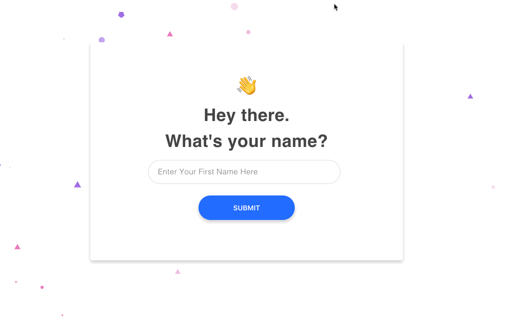

I built this in a couple of days unprompted to test my ability with a tech stack I guessed everydae had prior to working there!

# Everydae demo... demo

Rebuilding a couple of screens from: https://ui-dev-demo.everydae.com/. Trying out new libraries & frameworks, particularly react and graphql + apollo. This is a full stack app with a client, server and postgres database run in docker. 



## Installation

To run the app, run these commands from the root. Make sure to run the server and client in two separate terminal windows

```bash
docker-compose up -d
```

```bash
cd server && yarn && yarn start
```

```bash
cd client && yarn && yarn start
```

## Tech Stack Notables

Frontend
- create-react-app (react + webpack bundle)
- emotion.js (css in js)
- apollo client (state management and api)
- framer (animation)

Backend
- apollo server
- sequelize
- postgres
